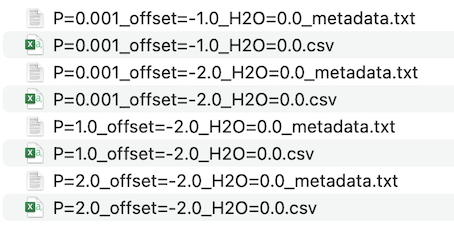

# Basic Usage

Simply put, `MAGEMinEnsemble` provides an interface to define a parameter space over which many `MAGEMin` simulations can be performed. It does this using two ordered dictionaries: `constant_inputs` and `variable_inputs`. As their names suggest, keys in `constant_inputs` assign the intensive variables that do not change across the ensemble of simulations. The keys in `variable_inputs` assign intensive variables that change across the ensemble.

Intensive variables are assigned using key-value pairs, where the key is always a string. `constant_inputs` contains values that are single floats or strings. `variable_inputs` contains values that are vectors of floats or strings. The same key cannot be assigned in both `constant_inputs` and `variable_inputs`: a parameter cannot be defined as both constant and variable in the same simulation.

The below example shows how the key and values of `constant_inputs` and `variable_inputs` can be assigned. These will define an ensemble of simulations over variable pressure, water and oxygen fugacity space. For a description of the available intensive variables, see section [Intensive Variables](@ref intensive_variables).

```Julia
# Assign a constant temperature range, bulk composition and oxygen fugacity buffer
constant_inputs = OrderedDict(
    # Set the initial, final and incremental
    # temperature in degrees celsius
    "T_start" => 1400.,
    "T_stop" => 800.,
    "T_step" => -1.,

    # Set bulk composition oxides in wt.% oxide
    "SiO2"  => 44.66,
    "TiO2"  =>  1.42,
    "Al2O3" => 15.90,
    "Cr2O3" =>  0.00,
    "FeO"   => 11.41,
    "Fe2O3" =>  6.00,
    "MgO"   =>  7.79,
    "CaO"   => 11.24,
    "Na2O"  =>  2.74,
    "K2O"   =>  0.22,

    # Set constant oxygen fugacity buffer
    "buffer" => "qfm"
)

# Assign variable pressure, oxygen fugacity buffer offset and water content
variable_inputs = OrderedDict(
    # Set variable pressure between 0.0 and 5.0 kbar in increments of 1.0
    "P" => collect(range(start=0.0, stop=5.0, step=1.0)),

    # Set variable oxygen fugacity buffer offset from
    # QFM-2.0 to QFM+2.0 in increments of 1.0 log units
    "offset" => [-2.0, -1.0, 0.0, 1.0, 2.0],

    # Set variable water content from 0.0 to 8.0 wt%
    #in increments of 1.0
    "H2O" => collect(range(start=0.0, stop=8.0, step=1.0))
)

# Run the simulations, store result in variable Output
Output = GenerateEnsemble.run_simulations(
    constant_inputs,
    variable_inputs,
    bulk_frac="frac"
    )
```


The `constant_inputs` and `variable_inputs` are passed to the `run_simulations()` function to generate and run the ensemble. The `bulk_frac` argument can be either `"bulk"` or `"frac"` to indicate bulk or fractional crystallisation. The results will be saved as appropriately named .csv files. For this ensemble, they will have the form "P=X\_offset=Y\_H2O=Z.csv", where X, Y and Z refer to the combination of values in `variable_inputs`. The .csv files will be accompanied by metadata.txt files.



To allow for further processing in Julia, the results are also stored in the variable `Output`.