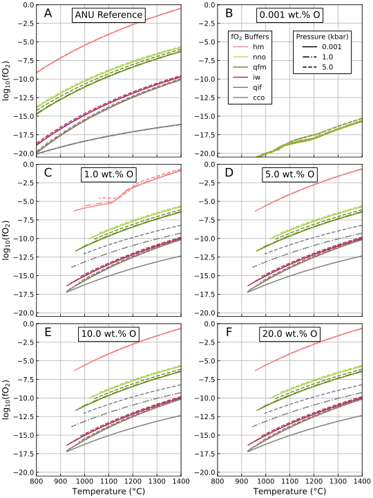
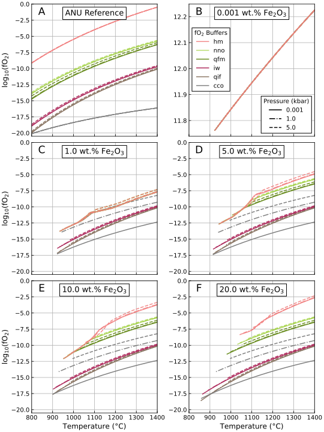

# Controlling Oxygen Fugacity

MAGEMin allows the oxygen fugacity of a simulation to be controlled in several ways:

1. Specify an oxygen fugacity buffer and/or offset, then prescribe the amount of free oxygen by:
    * Assigning the concentration of oxygen (O), or
    * Assigning the concentration of Fe₂O₃
2. Assign the concentration of oxygen (O) without specifying a buffer and/or offset
3. Assign the concentration of Fe₂O₃, without specifying a buffer and/or offset

MAGEMin does not allow both Fe₂O₃ and O to be assigned simultaneously.

In the first case, the amount of free oxygen must be sufficient to satisfy the specified oxygen fugacity buffer and offset. Any excess oxygen or ferrous iron will be ignored. However, this raises the question, how much O or Fe₂O₃ is sufficient? For Fe₂O₃, this is complicated by the fact that Fe₂O₃ inherently contains both Fe and O, meaning its addition affects the bulk composition beyond just contributing free oxygen.

This question can be addressed by performing a series of MAGEMin simulations with varying O or Fe₂O₃. Since oxygen fugacity buffers are dependent on both temperature and pressure, the simulations should be conducted across a range of buffers, pressures and O or Fe₂O₃ concentrations.

The code below performs 90 bulk crystallisation simulations using MAGEMinEnsemble. The composition used is a well-studied peridotite-like composition, KLB-1 (ref). The simulations are performed at 1-degree temperature steps between 1400 and 800 °C. To examine the effect of pressure, simulations are performed at 1 bar, 1.0 kbar, and 5.0 kbar. All oxygen fugacity buffers currently available in MAGEMin are tested. Finally the simulations are performed with variable oxygen, or Fe₂O₃, contents, at 0.0, 1.0, 5.0, 10.0 and 20.0 wt.%.
```julia
constant_inputs = OrderedDict{}(
    # Set the initial, final and incremental
    # temperature in degrees °C
    "T_start" => 1400.,
    "T_stop" => 800.,
    "T_step" => -1.,

    # Set KLB-1 bulk composition oxides in wt.% oxide
    "SiO2"  => 44.66,
    "TiO2"  =>  1.42,
    "Al2O3" => 15.90,
    "Cr2O3" =>  0.00,
    "FeO"   => 11.41,
    "MgO"   =>  7.79,
    "CaO"   => 11.24,
    "Na2O"  =>  2.74,
    "K2O"   =>  0.22,
    "H2O"   =>  0.00
)

variable_inputs = OrderedDict(
    "P" => [0.0, 1.0, 5.0],
    "O" => [0.0, 1.0, 5.0, 10.0, 20.0],
    # or "Fe2O3" => [0.0, 1.0, 5.0, 10.0, 20.0]
    "buffer" => ["qfm", "qif", "nno", "hm", "iw", "cco"]
)

# Perform the bulk crystallisation simulations using
# the igneous thermodynamic database of Green+2025
MAGEMinEnsemble.GenerateEnsemble.run_simulations(
    constant_inputs,
    variable_inputs,
    "bulk", "ig", "wt"
    )
```

## Results

### Buffered with Variable Oxygen
The oxygen fugacity at each temperature step is recorded by MAGEMin and can be plotted for each oxygen concentration. [Figure 1.]() presents the result for 0.001 (practically 0.0), 1.0, 5.0, 10.0 and 20.0 wt.% oxygen. The lines are coloured according to the assigned oxygen fugacity buffer.

The first subfigure (A) displays the temperature-oxygen fugacity relationships for each buffer, as calculated using the [Australian National University (ANU) oxygen fugacity buffer online calculator](https://fo2.rses.anu.edu.au/fo2app/). For further details, see Anenburg and O'Neill (2019).


<figcaption>

**Figure 1:** Reference and simulated oxygen fugacities (fO₂), for a given buffer, pressure and temperature. Colours reflect the defined oxygen fugacity buffer. Solid lines represent simulations performed at 1 bar, dot-dashed lines represent 1 kbar, and dashed lines represent 5 kbar. (**A**) Reference oxygen fugacities from the online [Oxygen fugacity buffer calculator](https://fo2.rses.anu.edu.au/fo2app/). The effect of variable oxygen on the simulations is shown for: (**B**) 0.001, (**C**) 1.0, (**D**) 5.0, (**E**) 10.0, and (**F**) 20.0 wt.% O.

<figcaption>

At 0.001 wt.% oxygen, the simulation's oxygen fugacity behaves unpredictably, remaining at low oxygen fugacities (**Figure 1B**). At 1.0 wt.% oxygen, simulations performed at all buffers except for the highest available oxygen fugacity buffer (Hematite-Magnetite) behave as expected, with the latter exhibiting unstable behaviour below approximately 1100 °C (**Figure 1C**). At and above 5.0 wt.% oxygen, simulations performed at all buffers behave in a stable manned throughout the specified temperature range (**Figure 1D-F**).

!!! note
The oxygen fugacity buffers in MAGEMin do not behave identically to those in the online calculator. For the most part, the differences are negligible, but the discrepancy is particularly evident for the Carbon-Carbon Monoxide buffer (CCO).

Overall, the MAGEMin simulations behave as expected. When sufficient oxygen is provided to saturate the oxygen fugacity buffer, the simulations follow the defined buffer behaviour. For the KLB-1 bulk composition, 5.0 wt.% O provides sufficient free oxygen so that all simulations behave according to their specified buffer.

### Buffered with Variable Fe₂O₃
Similarly, simulations can be performed with variable Fe₂O₃ concentrations. The results are shown below in **Figure 2**.



<figcaption>

**Figure 2:** Reference and simulated oxygen fugacities (fO2), for a given buffer, pressure and temperature. Colours reflect the defined oxygen fugacity buffer. Solid lines represent 1 bar, dot-dashed lines represent 1 kbar, and dashed lines represent 5 kbar. **A.** Reference oxygen fugacities from the online [Oxygen fugacity buffer calculator](https://fo2.rses.anu.edu.au/fo2app/). The effect of variable Fe₂O₃ on MAGEMin simulations for: **B.** 0.001, **C.** 1.0, **D.** 5.0, **E.** 10.0, and **F.** 20.0 wt.% Fe₂O₃. Note the positive y-axis for subfigure **B**.

<figcaption>

Compared to the simulations with variable oxygen concentration, the oxygen fugacity behaviour of the MAGEMin simulations with variable Fe₂O₃ differs significantly. At 0.0 wt.% Fe₂O₃, the simulations yield unrealistically high, positive oxygen fugacities (**Figure 2B**). At 1.0 wt.% Fe₂O₃, only simulations set to the lower oxygen fugacity buffers (Iron-Wüstite, Quartz-Ilmenite-Fayalite, Carbon-Carbon Monoxide) show stable behaviour with decreasing temperature (**Figure 2C**). Simulations set to the Hematite-Magnetite and Nickel-Nickel Oxide buffers do not behave as according to their buffer.

Above 1100 °C the simulations behave in a stable manner. However, those set to the Magnetite-Hematite buffer have oxygen fugacities approximately 7.5 log units below their expected values and those set to the Nickle-Nickle Oxide buffer are approximately 2.5 log units below their expected values. Below 1100 °C, simulations set to these two buffers converge (**Figure 2C**), and do not behave as if they are buffered.

At higher Fe₂O₃ concentrations, the behaviour of simulations for the two more oxidising buffers gets closer to their expected behaviour (**Figure 1D-F**). At 10.0 wt.% Fe₂O₃, simulations set to the Nickel-Nickel Oxide buffer behave according to their buffer (**Figure 1E**). However, even at 20.0 wt.% Fe₂O₃, simulations set to the Hematite-Magnetite buffer do not behave according to the buffer below 1100 °C (**Figure 1F**).

## Implications and Recommendations
The results of these simulations highlight the importance of providing sufficient free oxygen or ferric iron when using oxygen fugacity buffers in MAGEMin.

### Importance of Sufficient Free Oxygen
For buffered simulations to behave as expected, enough free oxygen must be provided from either O or Fe₂O₃. Without it, the two cases behave very differently. When O is set to 0.0 wt.%, the simulations have very low fO₂ regardless of buffer. In contrast, when Fe₂O₃ is set to 0.0 wt.%, the simulations have extremely high, non-geologically realistic fO₂.

### Challenges with Fe₂O₃
Unlike O addition, using Fe₂O₃ to control oxygen fugacity introduces complexity due to its effect on the overall bulk composition. With increasing Fe₂O₃ you add both oxygen and affect the bulk composition. The bulk composition is normalised to 100 wt.% which includes Fe₂O₃ but not O, this reduces the relative concentrations of other oxides.

### Implications for Modelling
For bulk compositions containing both ferric and ferrous iron, users should redistribute iron as FeO\_{total}, apply the desired buffer and/or offset, and provide at least 5.0 wt.% oxygen (the exact value will be bulk composition and buffer dependent) to ensure buffered behaviour.

Use of Fe₂O₃, instead of O, to provide free oxygen may result in non-buffered behaviour, especially for oxidising buffers.
